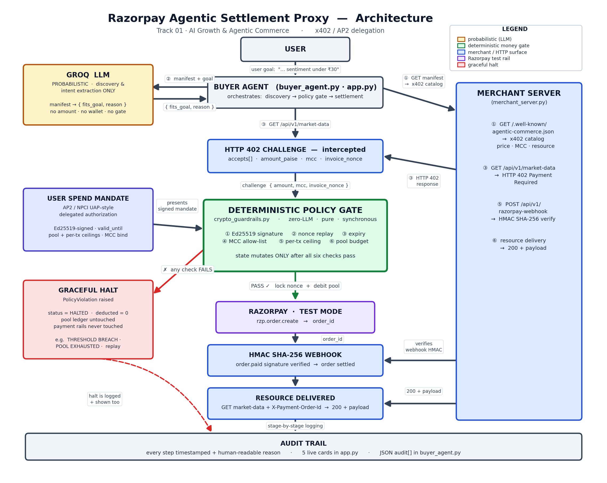
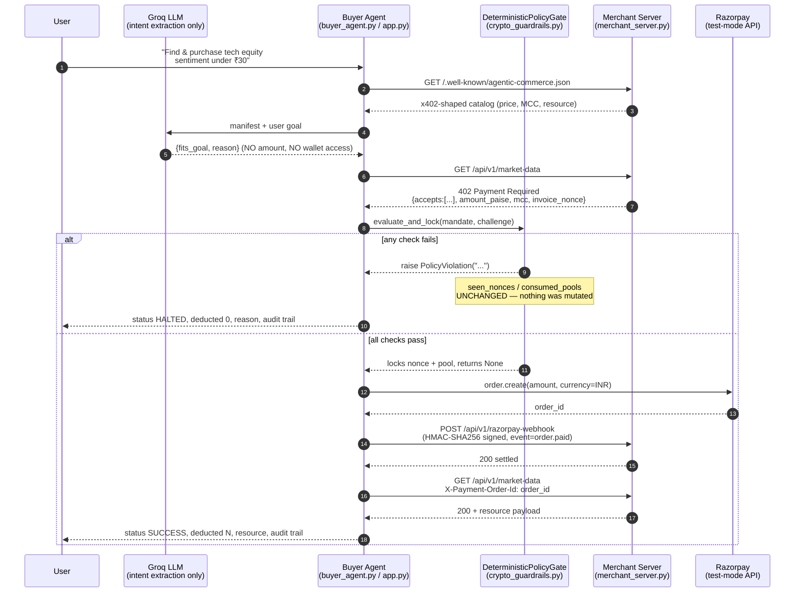

# Razorpay Agentic Settlement Proxy

**Razorpay AI Buildathon — Track 01: AI Growth & Agentic Commerce**
*"Grow the merchant's revenue, and make them sellable to AI buyers."*

An AI buyer agent discovers a paid merchant API, negotiates an HTTP 402
challenge, and settles a real Razorpay test-mode order — but the LLM is never
in the room when money moves. Every rupee is authorized by a deterministic,
zero-LLM policy gate against a cryptographically signed spend mandate, and
every rejection is proven to leave zero trace on the ledger.

---

## THE BAR, and how this repo clears it

> *"Every money action explainable, bounded and gated. Show the audit trail
> and one failure handled gracefully."*

| Requirement | Where |
|---|---|
| **Explainable** | Every step (manifest fetch, LLM plan, 402 challenge, gate verdict, order, webhook, delivery) is appended to a structured `AuditTrail` with a timestamp and a human-readable reason — surfaced as [`buyer_agent.py`](buyer_agent.py)'s `audit` list and as five live cards in [`app.py`](app.py). |
| **Bounded** | [`SpendMandate`](crypto_guardrails.py) carries a hard `max_per_tx_paise` ceiling, a cumulative `pool_limit_paise` ceiling, an `allowed_mcc` allow-list, and a `valid_until` expiry — checked in that order, before a single paisa moves. |
| **Gated** | [`DeterministicPolicyGate.evaluate_and_lock`](crypto_guardrails.py) is the *only* code path that may call Razorpay. It is pure Python — no model call, no network, no randomness beyond the wall clock. |
| **Audit trail** | [`app.py`](app.py)'s five telemetry cards, or `buyer_agent.py`'s JSON `audit` array, for every run. |
| **One failure handled gracefully** | Five, actually: price tampering, unauthorized MCC, nonce replay, pool exhaustion, and an unreachable merchant/HTTP surprise — each caught, reported with a specific `PolicyViolation` message, and halted before touching Razorpay. See [Failure scenarios](#failure-scenarios-you-can-run-right-now). |

---

## System architecture



*(Regenerate with `python render_architecture.py` — needs `matplotlib`.)*

The same flow as a sequence diagram:



```
┌──────────────┐   intent only    ┌────────────────┐
│   Groq LLM   │ ───────────────► │   Buyer Agent   │
│ (no wallet,  │ {fits_goal,      │ buyer_agent.py  │
│  no gate ref)│  reason}         │    app.py       │
└──────────────┘                  └────────┬────────┘
                                            │ challenge dict
                                            │ (amount, mcc, nonce)
                                            ▼
                                 ┌───────────────────────┐
                                 │ DeterministicPolicyGate│  ← THE money decision.
                                 │  crypto_guardrails.py  │    Pure, synchronous,
                                 │  • sig  • expiry       │    zero external calls.
                                 │  • MCC  • per-tx cap   │
                                 │  • pool budget         │
                                 │  • nonce replay        │
                                 └──────────┬─────────────┘
                                    PASS ↓        ↑ PolicyViolation
                                            │        (state untouched)
                            ┌───────────────┴──────────────┐
                            │        Razorpay (test)         │
                            │  order.create → HMAC webhook   │
                            └───────────────┬────────────────┘
                                            ▼
                                 ┌───────────────────────┐
                                 │   Merchant Server      │
                                 │  merchant_server.py    │
                                 │  402 → settled → 200   │
                                 └───────────────────────┘
```

### File map

| File | Role |
|---|---|
| [`crypto_guardrails.py`](crypto_guardrails.py) | `SpendMandate` (Ed25519-signed delegation) + `DeterministicPolicyGate` (the zero-LLM money decision). |
| [`merchant_server.py`](merchant_server.py) | FastAPI merchant: x402-shaped `/.well-known/agentic-commerce.json` catalog, `402` challenge issuance, HMAC-verified `order.paid` webhook, gated resource delivery. |
| [`buyer_agent.py`](buyer_agent.py) | CLI/library buyer: Groq LLM planning → gate → Razorpay settlement, with `--tamper-price` / `--unauthorized-mcc` / `--replay-nonce` / `--pool-exhaustion` attack flags. |
| [`app.py`](app.py) | Streamlit evaluator UI: live mandate signing, a scenario executor, and five audit-stage cards. |
| [`tests/test_guardrails.py`](tests/test_guardrails.py) | 11 pytest cases proving every guardrail *and* that rejected transactions leave zero state behind. |
| [`Dockerfile`](Dockerfile) / [`docker-compose.yml`](docker-compose.yml) | One shared image; `merchant` / `app` run as long-lived services, `buyer` / `tests` as one-off `docker compose run` targets. |
| [`architecture.png`](architecture.png) / [`render_architecture.py`](render_architecture.py) | The blockwise architecture flowchart, and the script that generates it. |

---

## Why this architecture wins: probabilistic LLM vs. deterministic money gate

The single hardest requirement in agentic commerce is also the simplest to
state: **a language model must never be the thing that decides money moves.**
LLMs are non-deterministic, promptable, and — however well-aligned — not
auditable in the way a `POST /orders` call needs to be. So this system draws
one hard line and never crosses it:

- **The LLM's blast radius is read-only intent extraction.** `llm_plan()` in
  [`buyer_agent.py`](buyer_agent.py) receives a manifest and a user goal, and
  returns exactly one boolean (`fits_goal`) plus a human-readable reason. It
  has no reference to `DeterministicPolicyGate`, no Razorpay credentials, and
  no way to construct or influence an amount, MCC, or nonce that gets
  charged. If the LLM is unreachable, wrong, or actively adversarial, the
  worst it can do is refuse a purchase that should have gone through — it
  can never authorize one that shouldn't.
- **The gate's blast radius is the entire financial decision, and nothing
  else.** `evaluate_and_lock()` is ~40 lines of synchronous Python: verify an
  Ed25519 signature, check a nonce set, check a timestamp, check a string
  against an allow-list, check two integers against two ceilings. No network
  call, no randomness, no model. Given the same mandate and challenge, it
  produces the same verdict every time — which is exactly what lets it be
  unit-tested exhaustively (see `tests/test_guardrails.py`) instead of merely
  "evaluated."
- **State only ever changes on a full pass.** `seen_nonces.add(...)` and
  `consumed_pools += ...` are the *last two lines* of `evaluate_and_lock`.
  Every failure path is a `raise` that exits before those lines run — so a
  rejected transaction is provably a no-op on the ledger, not just
  practically one. `test_rejected_transaction_never_consumes_the_nonce` and
  `test_rejected_transaction_never_deducts_pool_balance` assert this
  directly, and the Streamlit UI additionally refuses to write
  `st.session_state.spent_paise` unless the gate returned `SUCCESS`.
- **Settlement is downstream of the gate, never upstream.** `create_test_order`
  and `fire_settlement_webhook` are only reachable *after* `evaluate_and_lock`
  returns without raising — structurally, not just by convention. Grep the
  call sites: there is no path from a caught `PolicyViolation` to a Razorpay
  API call.

The result: an LLM can be swapped, upgraded, downgraded, or turned off
entirely, and the worst-case financial exposure of this system does not
change, because the LLM was never part of the trust boundary that controls
money.

---

## Alignment with NPCI UAP, AP2, and x402

The brief names three live standards efforts around agent-to-agent commerce.
This repo doesn't claim to *be* any of them — it's a hackathon-scoped,
India/Razorpay-shaped implementation — but it deliberately mirrors each
one's core primitive:

- **NPCI UAP (Unified Authorization Protocol)** is about a human issuing a
  bounded, revocable authorization that an intermediary (an agent, an app)
  can act within — not an open-ended mandate to spend. `SpendMandate` is
  exactly that shape: a signed, expiring, category-bound, amount-bound
  permission slip, separate from any individual transaction attempt.
- **AP2 (Agent Payments Protocol)** formalizes a *mandate* as a
  cryptographically verifiable object a user signs once, which agents then
  present against for individual payments, with the payment processor (here,
  the `DeterministicPolicyGate`) responsible for checking that presentment
  against the mandate's terms before money moves. `canonical_bytes()` (sorted
  keys, stable JSON, UTF-8) is what makes that signature verifiable and
  replay-safe — the same bytes sign and verify, deterministically, on any
  machine.
- **x402** standardizes the *shape* of a payment challenge: an HTTP `402`
  response body carrying `x402Version` and an `accepts[]` array of
  `PaymentRequirements` (`scheme`, `network`, `maxAmountRequired`, `resource`,
  `payTo`, `asset`, `extra`). `merchant_server.py` emits exactly that
  envelope — under a `razorpay-inr` scheme on a `razorpay-test` network,
  since Razorpay/INR settlement isn't a native x402 crypto scheme — with the
  India-specific fields (MCC, paise amount, invoice nonce) carried in
  `extra`, x402's own designated extension point. Any x402-aware agent can
  parse `GET /.well-known/agentic-commerce.json` or a `402` response without
  bespoke glue code.

---

## Quickstart

Requires Python 3.11+ and the dependencies already vendored into `venv/`
(`fastapi`, `uvicorn`, `pydantic`, `cryptography`, `pytest`, `httpx`,
`streamlit`, `razorpay`, `groq`, `python-dotenv`). `.env` holds
`RAZORPAY_KEY_ID` / `RAZORPAY_KEY_SECRET` / `RAZORPAY_WEBHOOK_SECRET` (all
Razorpay **test-mode**) and `GROQ_API_KEY` (optional — the buyer agent falls
back to a deterministic heuristic planner if it's absent or the API errors).

```powershell
# 1. Merchant server (terminal 1)
venv\Scripts\python -m uvicorn merchant_server:app --host 127.0.0.1 --port 8000

# 2a. CLI buyer agent (terminal 2) — happy path
venv\Scripts\python buyer_agent.py

# 2b. ...or an attack scenario
venv\Scripts\python buyer_agent.py --tamper-price
venv\Scripts\python buyer_agent.py --unauthorized-mcc
venv\Scripts\python buyer_agent.py --replay-nonce
venv\Scripts\python buyer_agent.py --pool-exhaustion

# 2c. ...or the Streamlit evaluator UI (terminal 2)
venv\Scripts\python -m streamlit run app.py
```

Open `http://localhost:8501`, configure the mandate sliders in the sidebar,
pick a scenario in the Scenario Executor, and click **Execute**.

### Running it with Docker instead

One image (`Dockerfile`), four roles selected via `docker-compose.yml`:
`merchant` (FastAPI, port 8000), `app` (Streamlit, port 8501), and two
one-off CLI services, `buyer` and `tests`, that aren't started by `up`.

```bash
cp .env.example .env        # fill in real Razorpay test-mode keys + GROQ_API_KEY

docker compose build        # builds the shared image once (tagged agentic-settlement-proxy:latest)
docker compose up -d merchant app

# open http://localhost:8501 — the app container reaches the merchant
# container over the compose network at http://merchant:8000

docker compose run --rm tests                  # 11 passed
docker compose run --rm buyer                  # happy path, from inside the network
docker compose run --rm buyer --tamper-price   # any of the attack flags work here too

docker compose down
```

### Automated tests

```powershell
venv\Scripts\python -m pytest tests/ -v
```

```
11 passed
```

covering: valid-mandate pass, invalid signature, pool exhaustion, nonce
replay, disallowed MCC, expired mandate, per-tx threshold breach, price
tampering via a mutated challenge dict, and two dedicated state-integrity
tests proving a rejected transaction burns neither a nonce nor a paisa.

---

## Failure scenarios you can run right now

| Scenario | Trigger | Gate verdict |
|---|---|---|
| **Happy path** | `buyer_agent.py` (no flags) / "✅ Happy Path" in the UI | `SUCCESS` — real Razorpay test order created, HMAC webhook verified, resource delivered. |
| **Price tampering** | `--tamper-price` / "💸 Price Tampering" | `HALTED` — `THRESHOLD BREACH: ₹500.00 exceeds single-tx ceiling of ₹30.00`. |
| **Unauthorized MCC** | `--unauthorized-mcc` / "🎰 Unauthorized MCC" | `HALTED` — `merchant category code not allowed: 7995`. |
| **Nonce replay** | `--replay-nonce` / "🔁 Replay Attack" | `HALTED` — `replayed invoice nonce: <hex>`. |
| **Pool exhaustion** | `--pool-exhaustion` / "🪫 Pool Exhaustion" | `HALTED` — `POOL EXHAUSTED: ₹25.00 requested but only ₹X.XX remains of the ₹Y.YY pool`. |

Every `HALTED` result carries `deducted: 0` and leaves
`DeterministicPolicyGate.consumed_pools` / `.seen_nonces` byte-for-byte
unchanged — verified both by `tests/test_guardrails.py` and, in the UI, by
the "Consumed Quota" metric staying put across a blocked run.
